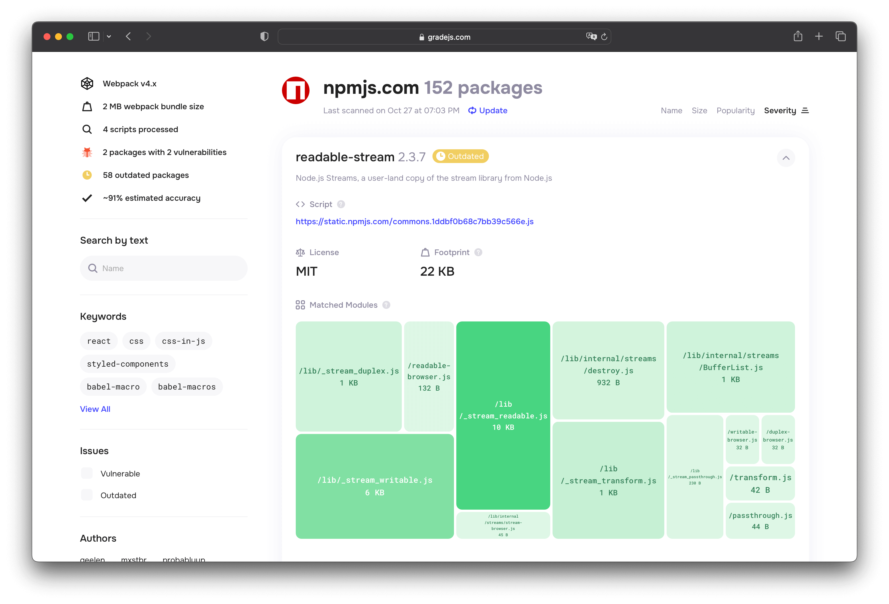
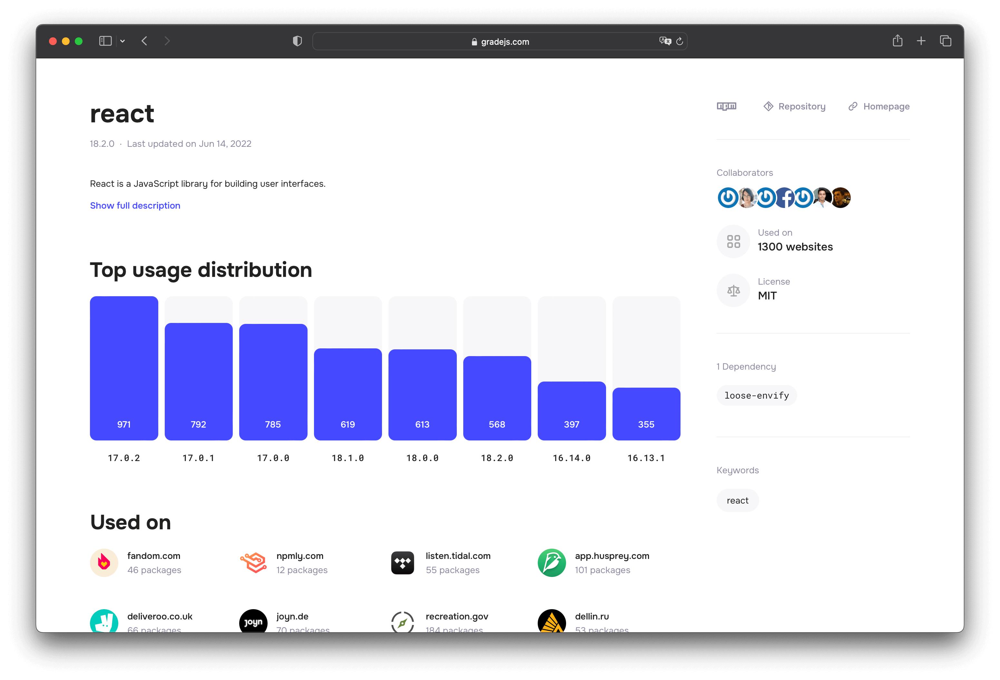

# GradeJS

GradeJS is an open-source project that allows you to analyze webpack production bundles without having access to the source code of a website. It detects a list of bundled NPM libraries and works even for minified or tree-shaken bundles.

It parses the abstract syntax tree from a JavaScript file, detects the webpack bootstrap entities and localizes module boundaries. A webpack-bundled module usually represents either a single file of an NPM library or a subset of concatenated files. By using built-in AST hash functions, GradeJS generates special signatures per each exported entity, which are retrospectively looked up in the pre-made database index by a matching algorithm. The matching algorithm is quite straightforward and based on a probabilistic approach.

More info:

- [How it works?](https://github.com/gradejs/gradejs/discussions/6)
- [Understanding Accuracy](https://github.com/gradejs/gradejs/discussions/8)

## How to use

Go to the [https://gradejs.com/](https://gradejs.com/) and enter a site in the `https://example.com` format. An analysis is performed server-side. Once the bundle is analyzed, the package name, version, size, and relative percentage size of the packages are returned.

## Supported bundlers & packages

Current beta version supports [webpack](https://webpack.js.org/) from 3 to 5 and have indexed ~3,000 most popular NPM libraries over ~100,000 releases.

## Contributing

We value your feedback, please use Discussions for questions and comments. If you encounter any suspicious behavior, false or missing results, please file a new issue. At this stage, we don't expect direct code contributions yet.
