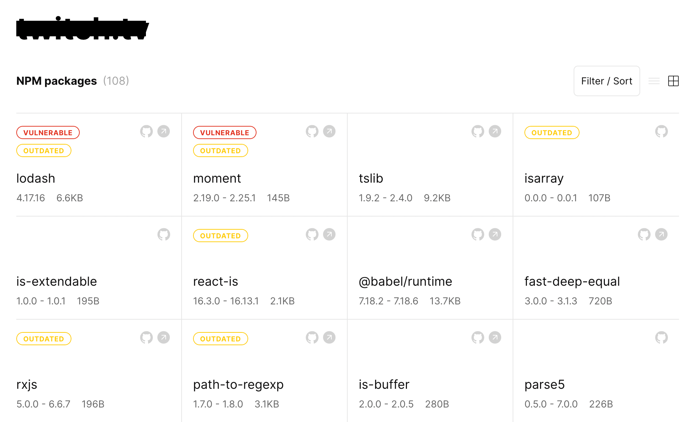

# GradeJS

GradeJS is an open-source project that allows you to analyze webpack production bundles without having access to the source code of a website. It detects a list of bundled NPM libraries and works even for minified or tree-shaken bundles.

More info:

- [How it works?](https://github.com/gradejs/gradejs/discussions/6)
- [Understanding Accuracy](https://github.com/gradejs/gradejs/discussions/8)

[//]: # 'TODO: Add a gif later'

## How to use

Go to the [https://gradejs.com/](https://gradejs.com/) and enter a site in the `https://example.com` format. An analysis is performed server-side. Once the bundle is analyzed, the package name, version, size, and relative percentage size of the packages are returned.

## Supported bundlers & packages

Currently it supports [webpack](https://webpack.js.org/) from 3 to 5 and have indexed 1,826 most popular NPM libraries over 54,735 releases. The complete list of indexed packages can be found [here](https://docs.google.com/spreadsheets/d/1x_D4KsG-Q1bzej2zisqM7I0FOLJaDfRXCwH_cFOFRwQ/preview).

## Contributing

We value your feedback, please use Discussions for questions and comments. If you encounter any suspicious behavior, false or missing results, please file a new issue. At this stage, we don't expect direct code contributions yet.
